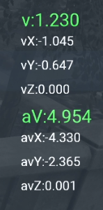

# Velocity Tracker
## A velocity tracker for Hitman WoA 
- Made using the ZHMModSDK mod template
- Based off of an outdated Velocity mod 

## Installation Instructions

1. Download the latest version of [ZHMModSDK](https://github.com/OrfeasZ/ZHMModSDK) and install it.
2. Download the latest version of `VelocityTracker` and copy it to the ZHMModSDK `mods` folder (e.g. `C:\Games\HITMAN 3\Retail\mods`).
3. Run the game and once in the main menu, press the `~` key (`^` on QWERTZ layouts) and enable `VelocityTracker` from the menu at the top of the screen.
4. Enjoy!

## Mod UI

- ### v = The current velocity of 47
- ### aV = A rolling average velocity from the last X amount of frames 
- ### av(axis) = A rolling average velocity from the last X amount of frames for that axis
  - ### The amount of frames for the rolling average can be changed in settings
- ### v(axis) = The velocity for that axis

## Build It Yourself!

### 1. Clone this repository locally with all submodules.

You can either use `git clone --recurse-submodules` or run `git submodule update --init --recursive` after cloning.

### 2. Install Visual Studio (any edition).

Make sure you install the C++ and game development workloads.

### 3. Open the project in your IDE of choice.

See instructions for [Visual Studio](https://github.com/OrfeasZ/ZHMModSDK/wiki/Setting-up-Visual-Studio-for-development) or [CLion](https://github.com/OrfeasZ/ZHMModSDK/wiki/Setting-up-CLion-for-development).
